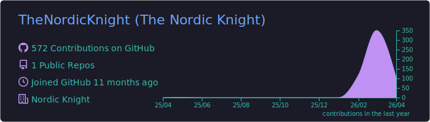
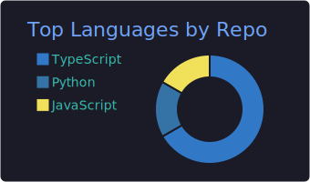
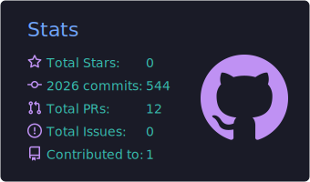
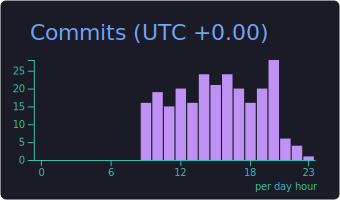

<!--
  Profile README for https://github.com/TheNordicKnight
  The summary-card SVGs are regenerated daily by .github/workflows/profile-summary-cards.yml
-->

<h1 align="center">Hi, I'm Nordic Knight</h1>

  <em>Replace this line with a one-sentence tagline about what you do and build.</em>

---

### Activity

### Profile

<table>
  <tr>
    <td width="50%"></td>
    <td width="50%"></td>
  </tr>
  <tr>
    <td width="50%"></td>
    <td width="50%"></td>
  </tr>
</table>

### Elsewhere

  
  

